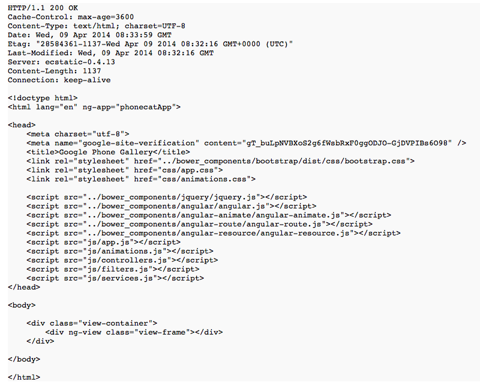
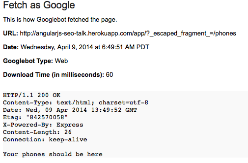
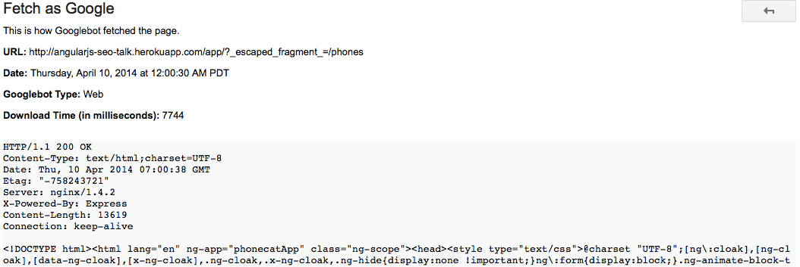
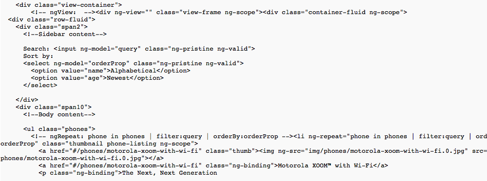

# AngularJS SEO
How to make google like your angular web site

by [@_joseraya](http://www.twitter.com/_joseraya)

-- 

### Disclaimer

I am no SEO expert. 

I am just a developer who was considering AngularJS for two 'non-application' situations:

* My company web site
* An ecommerce web site
---
## Is a SPA the right choice for you?

<small> let's assume that it is ;)  </small>

SEO implies you want a broad audience

what about users with JS disabled or with old browsers?

---
## How to make google see my content?

What you see:

--

What google sees:

<small> I used 'Fetch as google' from 'Google webmaster tools'</small>
--
### Where are my phones?

We need to tell google that our application is crawlable

    http://angularjs-seo-talk.herokuapp.com/app/#/phones
    
should become

    http://angularjs-seo-talk.herokuapp.com/app/#!/phones
    
and will become

    http://angularjs-seo-talk.herokuapp.com/app/?_escaped_fragment_=/phones

<small>https://developers.google.com/webmasters/ajax-crawling/docs/getting-started</small>

--

We need to handle this at the server

    app.get('/app/*', function (req, res) {

        if (req.query._escaped_fragment_) {
            console.log(req.query._escaped_fragment_);
            res.send("Your phones should be here");
            res.end();
        } else {
            res.sendfile(req.originalUrl, {
                root: __dirname + '/../'
            });
        }
    });

--

and configure angular to use hashbangs:

    phonecatApp.config(['$locationProvider',
        function ($locationProvider) {
            $locationProvider.hashPrefix('!');
        }]
    );

or use the 'fragment' meta

    <meta name="fragment" content="!" />

<small> see https://developers.google.com/webmasters/ajax-crawling/docs/specification </small>

--
... and this is what google sees now

    http://angularjs-seo-talk.herokuapp.com/app/?_escaped_fragment_=/phones

--

Alternatively, we can use the html5 mode in the router

    $locationProvider
      .html5Mode(true);
      
but then we have to be able to respond to /app/phones at the server and return the appropiate HTML

---
## How do I render my view at the server?

We can render 'on demand' (and cache the snapshots)

We can pregenerate 'snapshots' on build time

--

## Server side rendering 

We need a browser environment to render our pages 
<small>server side rendering has been in the roadmap but does not seem likely to be implemented in the short term</small>

[phantom.js](http://phantomjs.org/) -> Headless webkit

[slimer.js](http://slimerjs.org/) -> Gecko alternative to phantom.js, not truly headless

[zombie.js](http://zombie.labnotes.org/) -> Simulated browser (lightweight)

--

## Snapshot generation at build time

If you have a sitemap or a robots.txt (and you should) you can use any of the grunt tasks

[grunt-html-snapshots](https://github.com/localnerve/grunt-html-snapshots)

[grunt-html-snapshot](https://github.com/cburgdorf/grunt-html-snapshot)

--

If you don't, you can always crawl your site yourself:

    var Browser = require('zombie')
    ...
    var promise = browser.visit(uri)
    .then(function() {
        ...
        var links = browser.queryAll('a');
        links.forEach(function(link) {
            ...
        });
        ...
    });
    
--

### Has the template been rendered yet?

Angular may take some time to completely render the template 

    <html lang="en" ng-app="phonecatApp" data-status="{{status}}">
    
and then poll for the status:

    var intervalId = setInterval(function() {
        var status =  browser.body.getAttribute('data-status');
        if (status === "ready") {
            clearInterval(intervalId);
            ... // Now the templates have been rendered
        }
    }, 500);

<small>or you can wait for a predetermined amount of time (like 1s per page)</small>
---

## Can it be easier?

YES!

There are many ajax crawling services that will handle the snapshot generation and caching for you

[prerender](http://prerender.io)

[Brombone](http://www.brombone.com/)

[SEO4Ajax](http://www.seo4ajax.com/)
    
Just google ajax SEO :)

--

I like prerender because it is open source 

    $ npm install prerender-node --save
    
    app.use(require('prerender-node'));
    
    $ export PRERENDER_TOKEN=...
    
--
and now google sees this:

---
#Thank you!

