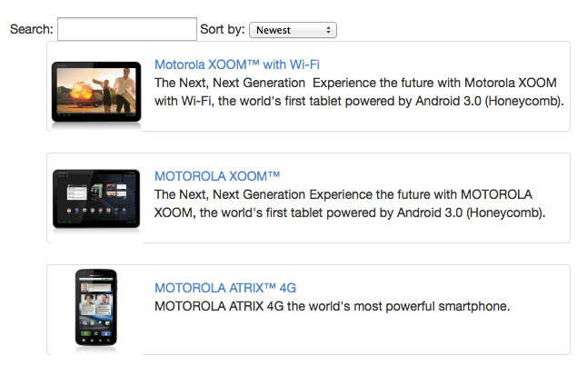

# AngularJS SEO
How to make your Angular app findable 

by [@_joseraya](http://www.twitter.com/_joseraya)

---
## Is a SPA the right choice for you?

<small> let's assume that it is ;)  </small>

SEO implies you want a broad audience

what about users with JS disabled or with old browsers?

---
## First problem: How to render your views without JS?

What you see:

--

What google sees:

--
## Where are my phones?

We need to tell google that our application is crawlable

    http://angularjs-seo-talk.herokuapp.com/app/#/phones
    
should become

    http://angularjs-seo-talk.herokuapp.com/app/#!/phones
    
and will become

    http://angularjs-seo-talk.herokuapp.com/app/?_escaped_fragment_=/phones

<small>https://developers.google.com/webmasters/ajax-crawling/docs/getting-started</small>

--

## We need to handle this at the server

    app.get('/app/*', function (req, res) {

        if (req.query._escaped_fragment_) {
            console.log(req.query._escaped_fragment_);
            res.send("Your phones should be here");
            res.end();
        } else {
            res.sendfile(req.originalUrl, {
                root: __dirname + '/../'
            });
        }
    });

--
... and this is what google sees now

    http://angularjs-seo-talk.herokuapp.com/app/?_escaped_fragment_=/phones

---
#Thank you!

